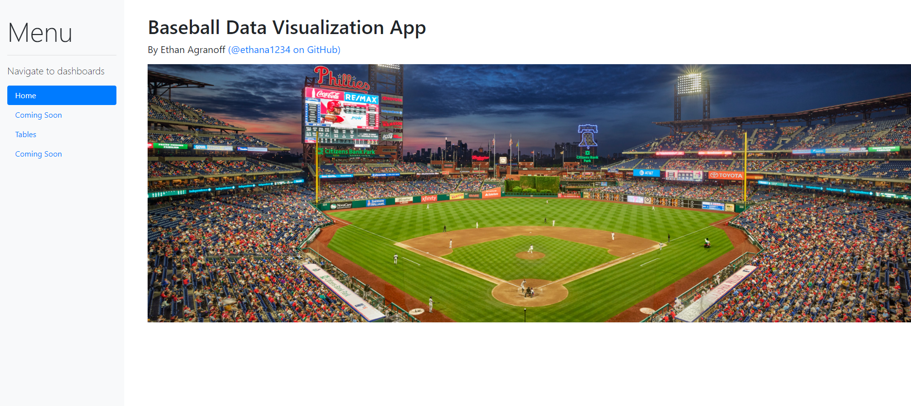

# Baseball Statistical Analysis and Visualization

## By Ethan Agranoff

#### Setup and Run

After cloning or forking the repo, create a Python virtual environment with:
```
python -m venv .venv
```
Verify that your terminal is using the new virtual environment.

Then install package requirements with:
```
pip install -r requirements.txt
```
And now you can run the application in the main repo directory with:
```
python index.py
```

Now navigating to http://localhost:8050 should bring up the home page


